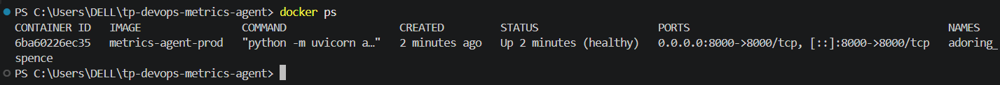
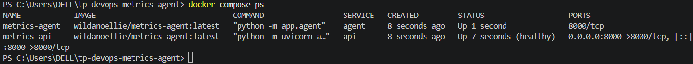
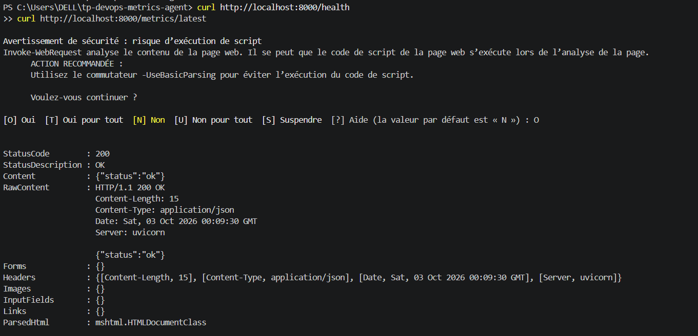
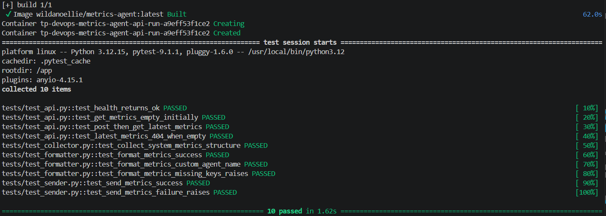
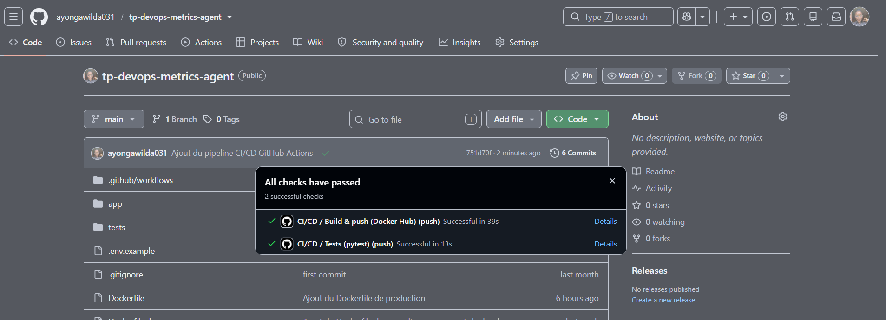
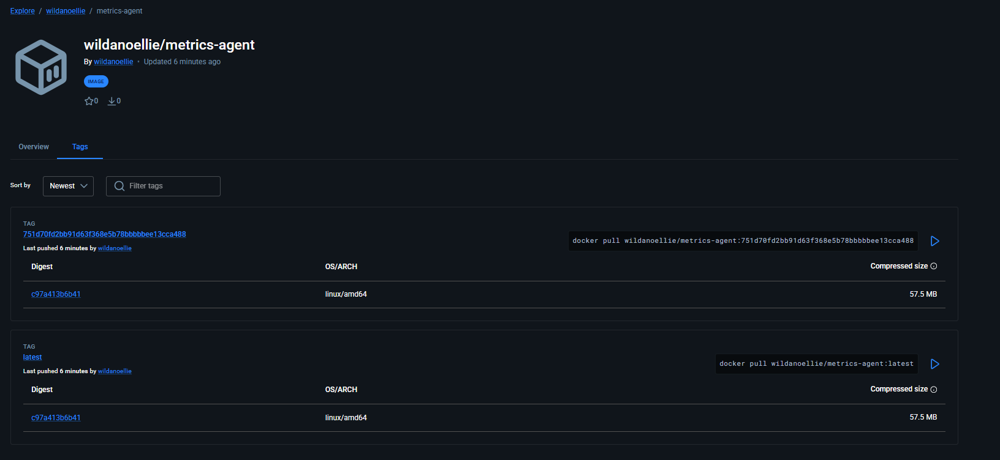
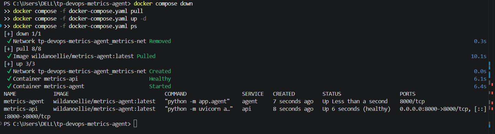
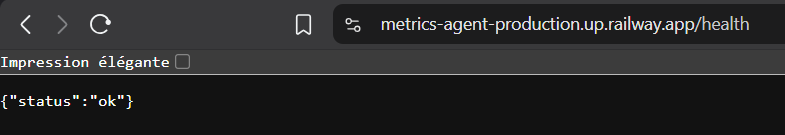
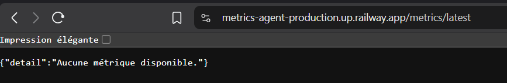

# System Metrics Agent — Conteneurisation, Orchestration & CI/CD

## 1. Présentation du projet et architecture

`system_metrics_agent` est un agent Python modulaire qui collecte des métriques système
(CPU, RAM, charge système) et les transmet en temps réel vers une API de réception.

Le projet est composé de deux processus :

- **`app.api`** : une API FastAPI (servie par `uvicorn`) qui expose `/health`, `/metrics`
  (GET/POST) et `/metrics/latest`.
- **`app.agent`** : un processus qui collecte les métriques toutes les
  `COLLECTION_INTERVAL` secondes et les envoie en HTTP à `METRICS_ENDPOINT`.

Architecture interne :

```text
app/
├── __init__.py
├── agent.py       # orchestration : collecte -> format -> envoi
├── api.py         # API FastAPI de réception des métriques
├── collector.py   # collecte CPU / RAM / charge (psutil, subprocess)
├── config.py      # configuration via variables d'environnement (.env)
├── formatter.py   # mise en forme du payload JSON
└── sender.py      # envoi HTTP des métriques
```

Flux de données :

```text
┌──────────────────┐
│ Système          │
│ CPU / RAM        │
└────────┬─────────┘
         │
         ▼
┌──────────────────┐
│ collector.py     │
│ psutil/subprocess│
└────────┬─────────┘
         │
         ▼
┌──────────────────┐
│ formatter.py     │
│ Payload JSON     │
└────────┬─────────┘
         │
         ▼
┌──────────────────┐
│ sender.py        │
│ HTTP POST        │
└────────┬─────────┘
         │
         ▼
┌──────────────────┐
│ FastAPI /metrics │
└──────────────────┘
```

Exemple de métrique envoyée :

```json
{
  "agent": "system-metrics-agent",
  "event_type": "system_metrics",
  "data": {
    "timestamp": "2026-08-27T12:00:00.000000+00:00",
    "hostname": "server-01",
    "cpu": {"percent": 23.4, "logical_cores": 8},
    "memory": {"total_bytes": 16777216000, "available_bytes": 8000000000, "used_bytes": 7777216000, "percent": 48.2},
    "system": {"load_1m": 0.12, "load_5m": 0.18, "load_15m": 0.20}
  }
}
```

Ce dépôt ajoute, autour de ce code métier (non modifié), toute l'infrastructure DevOps :
conteneurisation (dev + prod), orchestration Docker Compose, et pipeline CI/CD GitHub
Actions publiant automatiquement les images sur Docker Hub.

## 2. Prérequis

- Docker Desktop (ou Docker Engine + Docker Compose plugin)
- Un compte Docker Hub
- Git

## 3. Lancer en développement

Utilise `Dockerfile.dev` (hot-reload, dépendances de dev incluses). `docker-compose.override.yml`
est fusionné automatiquement avec `docker-compose.yaml` dès qu'il est présent dans le dossier :

```bash
cp .env.example .env
docker compose up --build
```

Le code local est monté en volume : l'API redémarre seule (`--reload`) à chaque
modification d'un fichier `.py` (testé et confirmé).

Pour lancer les tests à l'intérieur d'un conteneur de dev :

```bash
docker compose run --rm api pytest -v
```

## 4. Lancer en production

### 4.1 Build local (à partir de `Dockerfile`)

```bash
docker compose -f docker-compose.yaml up --build -d
docker compose -f docker-compose.yaml ps
```

### 4.2 À partir des images publiées sur Docker Hub (sans build local)

```bash
docker compose -f docker-compose.yaml pull
docker compose -f docker-compose.yaml up -d
```

Vérification dans les deux cas :

```bash
curl http://localhost:8000/health
curl http://localhost:8000/metrics/latest
```

## 5. Pipeline CI/CD

Fichier : [`.github/workflows/ci-cd.yml`](.github/workflows/ci-cd.yml)

**Déclenchement** : à chaque `push` et `pull_request` sur la branche `main`.

**Étapes** :

1. **`test`** : checkout du code, installation des dépendances (`requirements.txt`, qui
   inclut `pytest`), puis exécution de `pytest -v`. Le job échoue si un seul test échoue,
   ce qui bloque la suite du pipeline.
2. **`build-and-push`** (dépend du job `test` via `needs:`, ne s'exécute que sur un `push`
   vers `main`) : build de l'image de production à partir du `Dockerfile`, puis push vers
   Docker Hub avec deux tags : `latest` et le SHA du commit (`github.sha`).

**Secrets requis** (*Settings → Secrets and variables → Actions* du dépôt) :

| Secret | Valeur |
|---|---|
| `DOCKERHUB_USERNAME` | identifiant Docker Hub |
| `DOCKERHUB_TOKEN` | access token Docker Hub (Account Settings → Security → New Access Token) — jamais le mot de passe |

## 6. Images Docker Hub

Dépôt d'images public : **https://hub.docker.com/r/wildanoellie/metrics-agent/tags**

Tags publiés automatiquement par le pipeline à chaque push sur `main` :
- `latest`
- `<sha-du-commit>` (ex. `751d70fd2bb91d63f368e5b78bbbbbee13cca488`)

## 7. Choix techniques et difficultés rencontrées

- **Une seule image pour les deux services** (`api` et `agent`) : les deux processus
  partagent les mêmes dépendances et le même code applicatif. Le service exécuté est
  déterminé par la commande passée dans `docker-compose.yaml` (`uvicorn ...` pour `api`,
  `python -m app.agent` pour `agent`), plutôt que de construire deux images identiques.
- **Multi-stage build** : les dépendances sont installées dans un stage `builder` avec
  `pip install --target=`, puis copiées telles quelles dans l'image finale, pour éviter
  d'embarquer les outils de build dans l'image de production (image finale : 57.5 MB).
- **`requirements-prod.txt` séparé** : `requirements.txt` inclut `pytest` et les
  dépendances de test, nécessaires en dev/CI mais absentes de l'image de production.
- **`procps` installé dans les deux images** : `app/collector.py` appelle la commande
  système `uptime` via `subprocess` pour la charge système. Sans le paquet `procps`, cet
  appel échoue dans le conteneur.
- **Communication `agent` → `api` en réseau interne Docker** : `.env` définit
  `METRICS_ENDPOINT=http://127.0.0.1:8000/metrics`, valide seulement hors conteneurs.
  Entre deux conteneurs, chaque service a sa propre interface réseau : `127.0.0.1` dans
  le conteneur `agent` ne désigne pas l'API. `docker-compose.yaml` surcharge donc
  `METRICS_ENDPOINT` avec `http://api:8000/metrics`, en s'appuyant sur la résolution DNS
  interne de Docker Compose.
- **`healthcheck: disable: true` sur le service `agent`** : les deux services partageant
  la même image, ils héritent du même `HEALTHCHECK` (qui teste `/health` sur le port
  8000). L'agent ne sert aucune route HTTP : ce test échouait systématiquement sans
  refléter un vrai problème, il est donc désactivé spécifiquement pour ce service.
- **Healthcheck sans `curl`** : pour garder l'image minimale, le `HEALTHCHECK` utilise
  `python -c "urllib.request..."` plutôt que d'installer `curl`.
- **Utilisateur non-root** : les deux Dockerfiles créent un utilisateur dédié (`appuser`).
- **Tests pytest absents du dépôt fourni** : le README d'origine du projet et le sujet du
  TP mentionnent tous deux une suite de tests existante, mais le dépôt source
  (`Mficius/metrics_agent`) ne comportait en réalité aucun dossier `tests/`. Une suite de
  tests a donc été écrite spécifiquement pour ce TP (`tests/test_formatter.py`,
  `test_collector.py`, `test_sender.py`, `test_api.py`), couvrant les fonctions
  réellement présentes dans `app/`, sans modifier la logique métier existante.
- **`httpx2` plutôt que `httpx`** : la version de Starlette installée au moment du build
  exige `httpx2` (nouvelle génération du client HTTP) pour `TestClient`, `httpx` seul ne
  suffisant plus.

## 8. Preuves de fonctionnement

### Healthcheck en production


### Orchestration Docker Compose — api et agent actifs ensemble


### Appel API réussi (/health et /metrics/latest)


### Suite de tests pytest (10/10)


### Pipeline GitHub Actions — tous les checks réussis


### Image publiée sur Docker Hub (tags latest et SHA du commit)


### Déploiement depuis Docker Hub, sans build local


## 9. Bonus — Déploiement cloud réel

L'API a été déployée en conditions réelles sur [Railway](https://railway.app), directement
à partir de l'image publiée sur Docker Hub (`wildanoellie/metrics-agent:latest`), sans
build local.

**URL publique :** https://metrics-agent-production.up.railway.app

Endpoints testés et fonctionnels :
- `GET /health` → `{"status":"ok"}`
- `GET /metrics/latest` → `404` avec message explicite tant qu'aucune métrique n'a été
  envoyée (seule l'API est déployée sur cette plateforme, pas le service `agent`)


